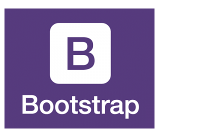

+++
title = "Abschluss Programmiertutorials"
date = "2020-12-02"
draft = false
pinned = false
image = "wordpress-html-code-einfuegen.jpg"
description = "Programmieren"
+++
# Programmieren

Heute habe ich hauptsächlich programmiert. Ich habe mich vor allem in den Teilen 5, 6 und 7 bewegt.

Teil 5 und 6 war nicht so schwierig und ich konntes Vieles dazulernen. Teil 7 hingegen war nicht so einfach, ich habe viel mehr Fehler gemacht. Vor allem mit Bootstrap hatte ich Mühe. Trotzdem konnte ich am Schluss Bausteine von Teil 7 in meiner Webseite einbauen. Im Grossen und Ganzen war ich mit dem finalen Stand meiner Webseite äusserst zufrieden.

# Projekt

Am Projekt habe ich wenig gearbeitet. Ich habe hauptsächlich Recherchen betrieben. Die daraus gewonnen Informationen werde ich für meinen nächsten Blogeintrag brauchen.