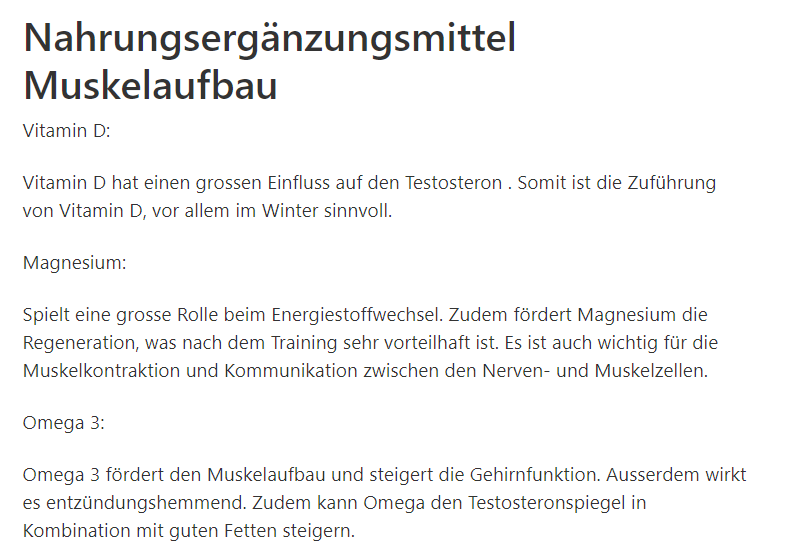

+++
title = "Photoshop und Projekte"
date = "2020-12-09"
draft = false
pinned = false
description = "Bilder bearbeitet\nProjekterweiterung"
+++
Zu Beginn habe ich mit Gimp Bilder bearbeitet. Als Leitfaden dienten YouTube Videos. In den Videos wurde sehr ausführlich erklärt, wie man Fotos bearbeitet. Im Grossen und Ganzen hatte ich mit dem Bearbeiten auch keine Mühe. Es sind gute Resultate rausgekommen. Ich war mit meiner Arbeit zufrieden.

Nach dem Bearbeiten habe ich mit Alina über die Projekte geredet. Wir haben vor allem über lebendigere Arbeiten bezüglich unserer Projekte besprochen. Denn die Arbeiten, die wir bisher gemacht haben, waren sehr monoton und nicht lebendig. Aber wir konnten am Schluss ein paar Lösungen zusammentragen.

Schlussendlich habe ich noch Recherche betrieben und an meinen Blogeinträgen gearbeitet.

