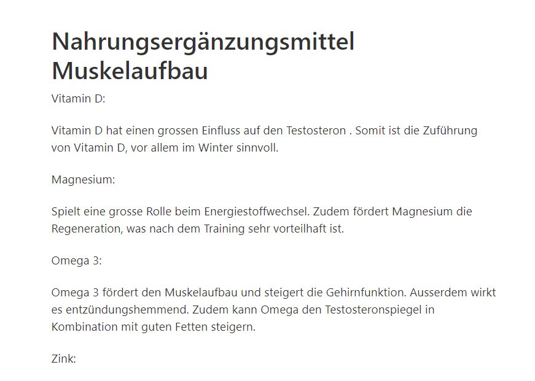

+++
title = "Weiterarbeiten Blogeinträge Supplements"
date = "2020-11-18"
draft = false
pinned = false
image = "lol-2.jpg"
description = "Muskelaufbau Supplemente\n"
+++
Ich habe heute vor allem an meinen Blogeinträgen zu Supplementen gearbeitet. Dafür habe ich eine grosse Recherche über die Wirkung der einzelnen Supplemente gemacht. Danach habe ich einen Blogeintrag verfasst, in dem ich all die gesammelten Informationen zusammenfasse. Zudem habe ich eine kurze Zeit weiterprogrammiert.

Im Blogeintrag war es das Thema "Nahrungsmittel für Muskelaufbau". Also Nahrungsergänzungsmittel, die einen positiven Einfluss auf den Muskelaufbau haben.

Ich konnte gemütlich an diesem Thema arbeiten und es hat mir Spass gemacht.

