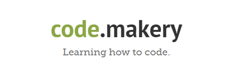
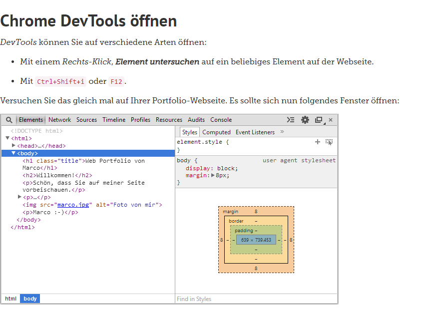

+++
title = "Weiterarbeiten mit Visual Studio Code"
date = "2020-11-11"
draft = false
pinned = false
image = "webi.png"
description = "Programmieren\nTeil 4 \"Entwicklertools im Browser\n"
+++
Heute habe ich mit Hilfe von Code makery weiterprogrammiert. Ich habe mich vor allem mit Teil 4 "Entwicklertools im Browser" beschäftigt. 

Ich habe ich neue Funktionen kennengelernt und angewendet. Ausserdem habe mit DevTools Webseiten untersucht und festgestellt, dass gewisse Webseiten extrem viele Codes enthalten. Aus Interesse habe ich die ganzen Codes angeschaut und ins Programm Visual Studio Code eingebaut.

Das Ganze hat mir grossen Spass verbreitet.