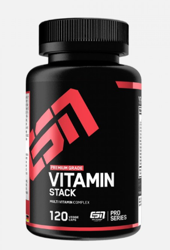

+++
title = "Wichtige Supplements für die Gesundheit Teil 1"
date = "2020-09-02"
draft = false
pinned = false
tags = ["Gesundheit", "Fitness", "Supplements", "Health", "Vitamine", "ESN"]
image = "vitamine-abcde-102__v-gseapremiumxl.jpg"
description = "Die wichtigsten Nahrungsergänzungsmittel für ein gesundes Leben,"
+++
# **Vitamine:**

Vitamine gehören zu den Mikronährstoffen und sind an vielen Prozessen im Körper verantwortlich.  Zudem unterscheidet man zwischen fettlösliche- und wasserlösliche Vitamine.

**Fettlösliche Vitamine:**

Vitamin A, E, D, K

**Wasserlösliche Vitamine:**

Vitamin C und  die B-Vitamine

**Vorkommen:**

Vor allem Früchte, Nüsse und Gemüse enthalten viele Vitamine. 

**Mängel:**

Vor allem Vitamin D ist ein Vitamin D, welches zu kurz kommt. Wenn zusätzlich die kalten Jahreszeiten kommen, kann unser Körper nicht genug Vitamin D aus der Sonne gewinnen. Dies führt zu einem Mangel. Ein Mangel an Vitamin D führt zu Müdigkeit und Muskelschwäche. Der Bedarf der restlichen Vitamine sollte durch eine ausgewogene Ernährung gut gedeckt werden. Der Einsatz mit Ergänzungspillen macht eigentlich nur bei einer strengen Diät oder im Winter Sinn.

**Empfehlung Supplement:**

Ich empfehle die Vitamin Kapseln von ESN. Das Produkt hat sehr gute Nährwerte und hat einen angemessen Preis. Ausserdem habe ich mit diesem Produkt nur positive Erfahrungen gesammelt.

https://www.esn.com/Produkte/Vitalstoffe/ESN-Vitamin-Stack-120-Kaps.html

